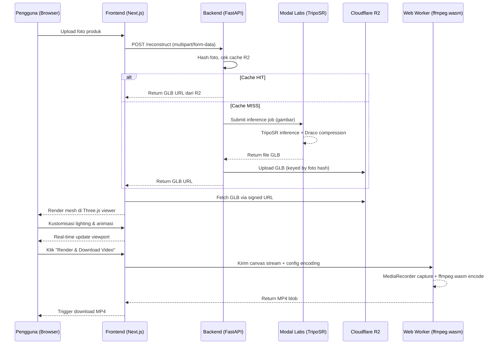
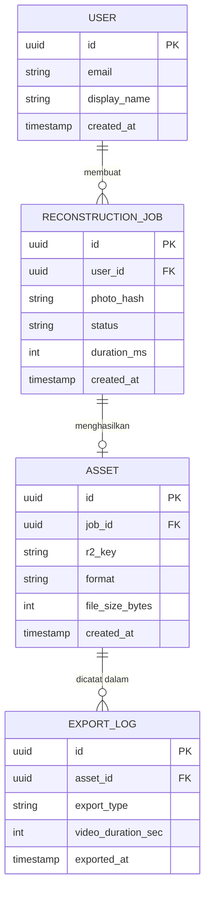

# Product Requirements Document
## SnapTo3D: Platform Presentasi Produk 3D Berbasis Web untuk UMKM

**Version:** 1.0.0
**Status:** Draft
**Mata Kuliah:** Grafika Komputer (RKA)

---

## 1. Overview

### Latar Belakang Masalah

Pelaku UMKM di Indonesia memasarkan produk melalui foto statis yang hanya menampilkan satu sisi objek — tidak menunjukkan volume, tekstur permukaan, atau dimensi nyata produk. Hasilnya, calon pembeli kesulitan memvisualisasikan produk secara utuh, dan kepercayaan serta konversi penjualan turun.

Solusi 3D yang tersedia saat ini (Adobe Dimension, Blender, platform AR berbayar) memiliki kurva belajar tinggi dan biaya lisensi yang tidak terjangkau untuk segmen UMKM. Tidak ada platform yang menggabungkan alur kerja sederhana — satu foto masuk, output visual 3D siap pakai — dalam satu antarmuka berbasis web.

### Solusi Utama

SnapTo3D adalah platform web yang memungkinkan UMKM mengubah satu foto produk menjadi mesh 3D interaktif dan video presentasi produk dalam waktu kurang dari 5 menit, tanpa instalasi software dan tanpa keahlian teknis.

Pipeline inti: foto produk → rekonstruksi AI (TripoSR via Modal GPU) → file GLB di Cloudflare R2 → Three.js viewer di browser → download GLB atau render video MP4 lokal.

### Target Audiens

Pemilik UMKM berusia 20–45 tahun, melek smartphone, tanpa latar belakang desain grafis atau grafika 3D. Pengguna yang membutuhkan konten produk visual berkualitas tinggi untuk media sosial dan marketplace (Tokopedia, Shopee, Instagram Shopping).

---

## 2. Requirements

- **Aksesibilitas:** Zero-install; berjalan sepenuhnya di browser modern (Chrome, Firefox, Edge, Safari) tanpa plugin atau runtime eksternal.
- **Target pengguna:** Non-teknis; alur kerja dirancang agar dapat diselesaikan tanpa panduan atau dokumentasi eksternal.
- **Spesifikasi input:** Satu foto produk (JPEG/PNG, maks. 10MB). Latar belakang polos menghasilkan rekonstruksi terbaik; tidak ada persyaratan multi-angle.
- **Tingkat detail output:** Mesh GLB/OBJ dengan Draco compression (target di bawah 2MB), UV-mapped, siap untuk viewer real-time maupun export video MP4.
- **Mekanisme peringatan:** Progress bar real-time selama proses rekonstruksi GPU. Notifikasi error eksplisit jika rekonstruksi gagal (objek transparan, reflektif tinggi, atau foto berkualitas rendah). Feedback visual responsif saat slider lighting dan animasi digeser.
- **Performa target:**
  - Rekonstruksi 3D: selesai dalam 5–15 detik.
  - Viewer load time pertama: di bawah 3 detik pada koneksi 10 Mbps.
  - FPS viewer: minimal 30 FPS di hardware mid-range (GPU Intel Iris atau setara) dengan mesh 20k polygon.
  - ffmpeg.wasm (~30MB) di-load lazy hanya saat fitur export diaktifkan.

---

## 3. Core Features

1. **Upload Foto Produk** — Antarmuka drag-and-drop dan file picker untuk upload foto JPEG/PNG. Validasi format dan ukuran file sebelum upload. Rekomendasi inline untuk latar belakang polos.

2. **Rekonstruksi 3D Berbasis AI** — Backend FastAPI meneruskan gambar ke serverless GPU endpoint (Modal Labs) yang menjalankan inferensi TripoSR. Output mesh diekspor ke format GLB dengan Draco compression dan disimpan di Cloudflare R2. Caching berbasis hash foto mencegah rekonstruksi duplikat.

3. **Viewer 3D Interaktif** — Viewport Three.js (WebGL) menampilkan mesh GLB dengan OrbitControls (rotate, zoom, pan via mouse/touch). Auto-rotate 360 derajat pada sumbu Y dengan delta yang dapat dikonfigurasi.

4. **Kontrol Lighting Real-Time** — Slider X/Y/Z untuk posisi DirectionalLight, slider intensitas cahaya, dan toggle soft shadow (shadow mapping berbasis depth map ke PlaneGeometry sebagai lantai virtual).

5. **Kontrol Animasi** — Toggle auto-rotate, slider kecepatan rotasi (velocity), dan input durasi video dalam detik.

6. **Export Aset 3D** — Tombol download file GLB/OBJ langsung dari Cloudflare R2.

7. **Export Video MP4 Client-Side** — Tombol "Render & Download Video" merekam canvas Three.js via MediaRecorder API lalu mengenkode ke MP4 menggunakan ffmpeg.wasm di Web Worker terpisah (non-blocking terhadap UI).

---

## 4. User Flow

1. **Landing** — Pengguna membuka SnapTo3D di browser; halaman utama menampilkan area upload.
2. **Upload** — Pengguna drag-and-drop atau memilih foto produk. Sistem memvalidasi format dan ukuran, lalu menampilkan preview foto.
3. **Rekonstruksi** — Pengguna menekan tombol "Generate 3D". Frontend mengirim foto ke FastAPI backend. Backend meneruskan job ke Modal GPU (TripoSR inference). Progress bar real-time ditampilkan selama proses berlangsung (estimasi 5–15 detik).
4. **Viewer** — Setelah rekonstruksi selesai, file GLB dimuat ke scene Three.js. Objek 3D tampil di viewport dengan OrbitControls aktif. Pengguna memutar, zoom, dan pan objek secara bebas.
5. **Kustomisasi** — Pengguna mengatur posisi dan intensitas cahaya via slider, mengaktifkan/menonaktifkan shadow, serta menyetel kecepatan animasi dan durasi video.
6. **Export** — Pengguna memilih:
   - **Download GLB** → file diunduh langsung dari URL Cloudflare R2.
   - **Render & Download Video** → ffmpeg.wasm di-load (jika belum), canvas direkam via MediaRecorder, encoding MP4 berjalan di Web Worker, file MP4 diunduh otomatis setelah selesai.

---

## 5. Architecture



---

## 6. Database Schema



| Entitas | Fungsi |
|---|---|
| `USER` | Menyimpan identitas pengguna terdaftar. Relasi ke semua job rekonstruksi yang pernah dibuat. |
| `RECONSTRUCTION_JOB` | Merekam setiap permintaan rekonstruksi: hash foto (untuk deduplication/cache), status job (queued, processing, done, failed), dan durasi inferensi GPU. |
| `ASSET` | Menyimpan metadata file GLB hasil rekonstruksi: key di Cloudflare R2, format (GLB/OBJ), dan ukuran file. One-to-one dengan job. |
| `EXPORT_LOG` | Mencatat setiap aksi export yang dilakukan pengguna (download GLB atau render video MP4), termasuk tipe export dan durasi video yang diminta. |

---

## 7. Design and Technical Constraints

### Stack Teknologi

| Layer | Teknologi |
|---|---|
| Frontend | React + Next.js, Three.js (WebGL), Tailwind CSS |
| 3D Rendering | Three.js: GLTFLoader, OrbitControls, DirectionalLight, shadow mapping |
| Video Export | MediaRecorder API, ffmpeg.wasm (via Web Worker) |
| Backend | FastAPI (Python), REST API + job orchestration |
| AI Inference | TripoSR (lisensi MIT) di Modal Labs Serverless GPU (billing per-detik) |
| Storage | Cloudflare R2 (object storage GLB, free tier 10GB, caching berbasis hash) |
| Database | PostgreSQL (atau SQLite untuk MVP lokal) |

### Panduan Teknis

- **Serverless GPU:** Modal Labs container warm selama 30 detik setelah request untuk meminimalkan cold start. Tidak ada biaya GPU saat idle.
- **Client-side encoding:** ffmpeg.wasm berjalan di Web Worker terpisah; tidak memblokir main thread. Binary ffmpeg.wasm (~30MB) di-cache di Service Worker setelah download pertama.
- **Draco compression:** Diterapkan pada output GLB sebelum upload ke R2; target ukuran di bawah 2MB untuk mesh kompleksitas sedang.
- **Lazy loading:** ffmpeg.wasm hanya di-load saat pengguna mengaktifkan fitur export video — bukan saat initial page load.
- **CORS & signed URL:** File GLB di R2 diakses via signed URL dengan TTL terbatas untuk keamanan.

### Tipografi

```css
--font-sans: 'Geist Mono', ui-monospace, monospace;
--font-serif: serif;
--font-mono: 'JetBrains Mono', monospace;
```

- `--font-sans` digunakan untuk seluruh teks antarmuka (label, tombol, navigasi).
- `--font-serif` digunakan hanya untuk konten editorial atau landing page jika ada.
- `--font-mono` digunakan untuk output teknis, metadata file, dan kode inline di UI.

### Keterbatasan yang Diketahui

- Kualitas rekonstruksi menurun untuk objek transparan (gelas kaca, plastik bening) dan objek dengan refleksi tinggi (logam mengkilap, perhiasan).
- TripoSR tidak dapat merekonstruksi permukaan yang tidak tampak di foto input (occluded surfaces); geometri sisi tersembunyi ditebak oleh model.
- Inferensi TripoSR membutuhkan GPU; tidak dapat berjalan offline atau sepenuhnya di sisi klien.
- ffmpeg.wasm 20–40% lebih lambat dari native encoding, tetapi trade-off ini dapat diterima untuk video pendek (5–30 detik) demi mengeliminasi biaya server encoding.
